<p align="center">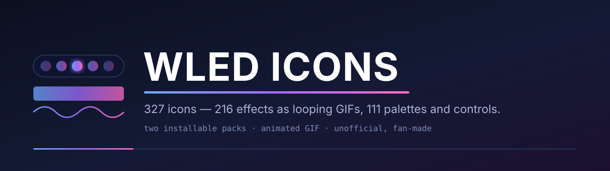</p>

# WLED icons for Elgato Stream Deck

**327 drop-in Stream Deck icons for [WLED](https://kno.wled.ge) — every effect as a looping animation, every colour palette as a swatch — so a key named *Fireworks* or *Lava* actually looks like it.**

> **Unofficial / fan-made.** Not affiliated with or endorsed by the WLED project.
> "WLED" is used only to name what these icons depict and are compatible with.
> WLED is a trademark of its authors.

### WLED Effects — 216 animated icons

<table>
  <tr>
    <td align="center">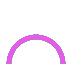<br><sub>Rainbow</sub></td>
    <td align="center">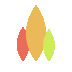<br><sub>Fire 2012</sub></td>
    <td align="center">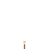<br><sub>Fireworks</sub></td>
    <td align="center">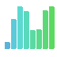<br><sub>GEQ</sub></td>
    <td align="center">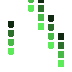<br><sub>Matrix</sub></td>
    <td align="center">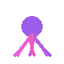<br><sub>Octopus</sub></td>
    <td align="center">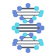<br><sub>DNA</sub></td>
    <td align="center"><br><sub>PS Fireworks</sub></td>
  </tr>
  <tr>
    <td align="center">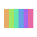<br><sub>Colorwaves</sub></td>
    <td align="center">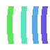<br><sub>Aurora</sub></td>
    <td align="center">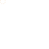<br><sub>Meteor</sub></td>
    <td align="center">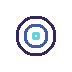<br><sub>Ripple</sub></td>
    <td align="center">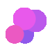<br><sub>Plasma</sub></td>
    <td align="center">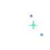<br><sub>Twinkleup</sub></td>
    <td align="center">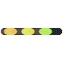<br><sub>Running</sub></td>
    <td align="center">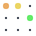<br><sub>Sparkle</sub></td>
  </tr>
</table>

### WLED Palettes & Controls — 111 static icons

<table>
  <tr>
    <td align="center">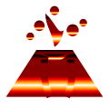<br><sub>Lava</sub></td>
    <td align="center">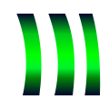<br><sub>Aurora</sub></td>
    <td align="center">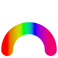<br><sub>Rainbow</sub></td>
    <td align="center">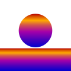<br><sub>Sunset</sub></td>
    <td align="center">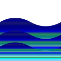<br><sub>Ocean</sub></td>
    <td align="center">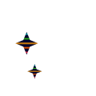<br><sub>April Night</sub></td>
    <td align="center">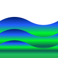<br><sub>Atlantica</sub></td>
    <td align="center">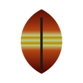<br><sub>Autumn</sub></td>
  </tr>
  <tr>
    <td align="center">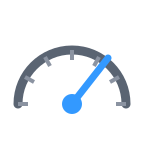<br><sub>Speed</sub></td>
    <td align="center">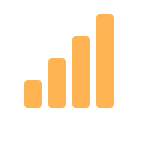<br><sub>Intensity</sub></td>
    <td align="center">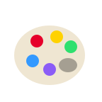<br><sub>Palette</sub></td>
    <td align="center">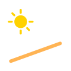<br><sub>Sunrise</sub></td>
    <td align="center">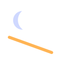<br><sub>Fade</sub></td>
    <td align="center"><br><sub>Segment</sub></td>
    <td align="center"><br><sub>Presets</sub></td>
    <td align="center"><br><sub>Push button</sub></td>
  </tr>
</table>

## Two packs

| Pack | Icons | Kind | Pack id |
|---|---|---|---|
| **WLED Effects** | **216** | animated GIF, 144 × 144, looping | `com.beennnn.wledeffects` |
| **WLED Palettes & Controls** | **111** | static PNG, 144 × 144 | `com.beennnn.wledpalettescontrols` |

**Licence: [CC0 1.0](LICENSE)** — public domain, no attribution required.

Two packs and not one because the Elgato Marketplace classifies a pack as
animated *or* static; separate listings match how people browse.

- **WLED Effects** — one looping icon per WLED effect id, from `Solid`,
  `Rainbow` and `Fire 2012` through the AudioReactive (`GEQ`, `Freqwave`), 2D
  (`Matrix`, `Octopus`, `DNA`) and Particle System (`PS Fireworks`,
  `PS Hourglass`) families. Each icon carries the effect's **motion**, not a
  colour — colour is what the palettes are for.
- **WLED Palettes & Controls** — all **72** colour palettes (`Lava`, `Aurora`,
  `April Night`…) plus 12 control-strip glyphs (speed, intensity, custom
  sliders…), 11 category tiles, 6 segment, 6 button-type and 4 nightlight icons.

## Install

The `.streamDeckIconPack` files are **not committed** — they are reproducible
build output. Either build them (below) and double-click the result, or install
from the Elgato Marketplace once the packs are published there.

```sh
bin/build.sh   # → dist/com.beennnn.wledeffects.streamDeckIconPack
               #   dist/com.beennnn.wledpalettescontrols.streamDeckIconPack
```

Double-clicking a `.streamDeckIconPack` installs it into the Stream Deck app;
the icons then show in the icon picker for any key or action.

---

## Build from source

This repo holds only the source assets (`src/`) and per-pack metadata; the
rendered `icons/`, `contact-sheet.png` and `dist/` are gitignored and
reproducible. Building needs Pillow, `rsvg-convert`, and
[`streamdeck-toolkit`](https://github.com/Beennnn/streamdeck-toolkit) (the
`sdicons` builder) cloned as a sibling directory or installed on `PATH`.

The animated effects are upscaled 72 → 144 with **nearest-neighbour** in palette
mode: an exact ×2 pixel double that keeps the LED grid crisp and preserves each
GIF's frame timing, loop and transparency. Static palettes and controls use
lanczos.

### Re-vendoring

`src/` is copied from [`openlamp/wled-assets`](https://github.com/openlamp/wled-assets)
and committed so the build is standalone. To refresh it after wled-assets changes:

```sh
python3 bin/vendor.py   # rebuilds src/ + each pack's tags.json from canonical WLED data
```

Marketplace submission checklist: [docs/SUBMISSION.md](docs/SUBMISSION.md).

## Licence

Icons are derived from **wled-assets** (CC0 1.0) and are likewise released under
**[CC0 1.0](LICENSE)** — public domain, no attribution required. A nod to
[WLED](https://kno.wled.ge) is appreciated. Unofficial fan project; WLED is a
trademark of its authors.

Built with [streamdeck-toolkit](https://github.com/Beennnn/streamdeck-toolkit).
